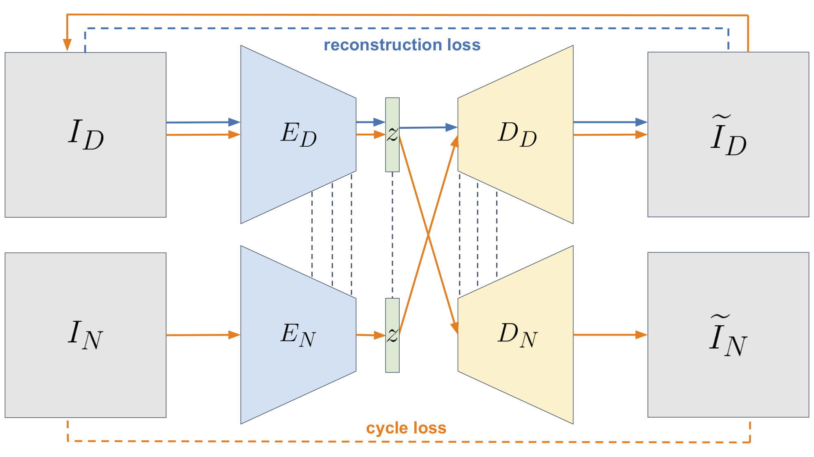
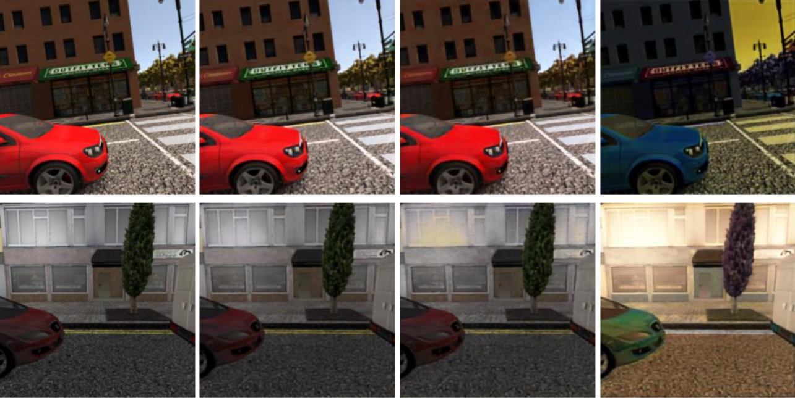
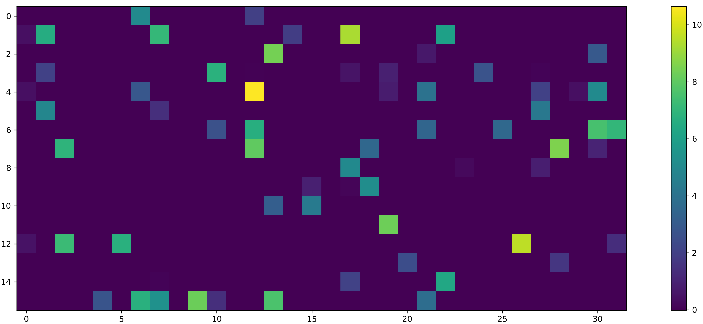
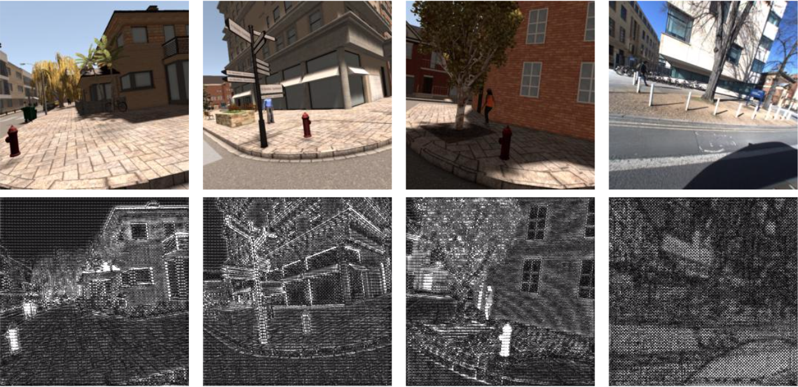
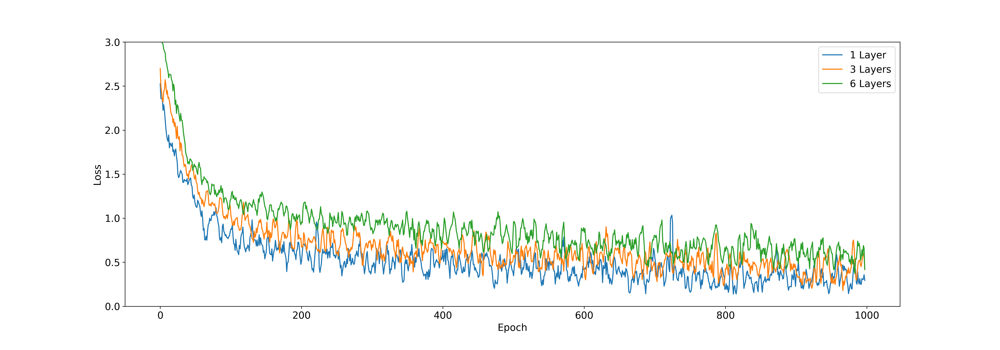

# Domain-Invariant Similarity Learning for Image Retrieval
The discipline of Image Retrieval deals with the task of identifying the most similar images in a data set, given a query image.
However, existing methods struggle with images of contrastive visual conditions, e.g. day and night. With this project, 
we developed an embedding function that can match images regardless of such conditions by disentangling structure 
from appearance. Unlike related approaches, we don't require an explicit domain translation. Instead, we aim at learning
a latent representation suited for direct comparison of images.

## Architecture
For training our embedding function, we employ a double-VAE structure based on the work of [3] and [2] that assumes a shared latent space as well as cycle consistency. Both autoencoders of our model have the same structure, 
and each is responsible for encoding and decoding from or to a specific domain. Our encoders and decoders share their last and first set of layers, respectively.

 

The encoders consist of eleven convolutional layers each, the last four of which are shared. We use no pooling layers, 
since too much information is lost in the process. Instead, we use a stride of two on selected layers. After the first three layers,
skip connections spanning two layers each are introduced. This helps combat the problem of vanishing gradients, which occurs due to the high number
 of layers the gradients need to be propagated through while computing the cycle loss.
    
The decoders are composed of eight convolutional layers, using skip connections. The first four of these layers are shared
between both decoders. After this we use two sets of upsampling, convolutional and batch normalization layers. Another convolutional
 layer reduces the number of channels to the required number of three, before a final sigmoid activation transforms each value into a (0,1) range.

## Results

 

 Columns: Original image, reconstruction, cycle reconstruction, domain translation;
 Rows: Day image, night image

### Unsupervised training

Using unsupervised learning only, we were able to achieve competitive results in the disciplines of domain translation and image retrieval.
Our learned encoders achieve comparable results to a pretrained VGG-16 network, in terms of triplet loss and latent space clustering. As opposed 
to VGG-16, they were trained with substantially less training data and are less complex.

### Supervised training

Using supervised siamese learning, we trained a channel weighting scheme for the encoder latent space which enabled us to exceed the VGG-16 performance with regard to latent space clustering. We were also able to show that only a small share of latent space channels (~8% in our experiments)
are important for triplet loss optimization. Moreover, we back-propagated these activations to pixel space, showing that said feature maps primarily
correspond to structural elements of buildings, as well as trees and small-scale landmarks like hydrants.

 

Importance of each of the 256 latent channel with regard to the triplet loss - most channels are not relevant.

  

 

Backpropagated activations of latent channel 206 to pixel space.

### Deep Feature Matching

In addition to only comparing the latent representations of images for image retrieval, we experimented with matching deep activations as well (see [5] for reference). However, our results show that more layers lead to longer training time and worse overall performance. This indicates that for our data set and model, the addition of more layers does not contribute valuable features while adding more complexity.

 

Triplet loss trends for different feature matching depths.

## Code Organization
This repository is divided into the following submodules:

- `datasets`: Contains `torch.data.Dataset` subclasses
- `models`: Models and everything model-related
- `utils`: Utility functions and classes

## Training

Take a look at `main_vae.py` or `main_triplet.py` to see how training is performed. In principle, you have to 
instanciate a `utils.config.TrainingConfig`, specifying dataset, model as well as parameters. Then, a `utils.training.Trainer`
can be instanciated with the training config. The training is started by calling `train()` on the `Trainer` object. Training can
be fully resumed from checkpoints which are saved every `save_every` epochs (specified in the `TrainingConfig`).

## Future Work
- Start out with pre-trained encoders
- Add discriminators to make decoder outputs more realistic

## Related Work

[1] [How to Train a CAT: Learning Canonical Appearance Transformations for Direct Visual Localization Under Illumination Change](https://github.com/utiasSTARS/cat-net)

[2] [Night-to-Day Image Translation for Retrieval-based Localization](https://github.com/AAnoosheh/ToDayGAN)

[3] [Unsupervised Image-to-Image Translation Networks](https://github.com/mingyuliutw/unit)

[4] [Deforming Autoencoders: Unsupervised Disentangling of Shape and Appearance](https://github.com/zhixinshu/DeformingAutoencoders-pytorch)

[5] [The Unreasonable Effectiveness of Deep Features as a Perceptual Metric](https://arxiv.org/abs/1801.03924)
